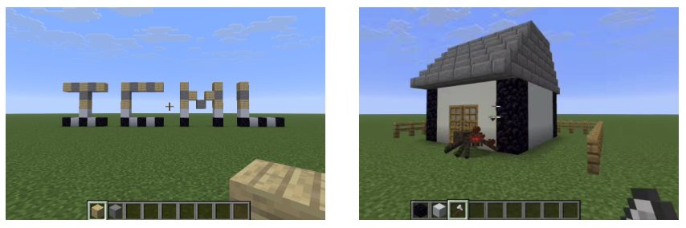

# LLM Collaboration – Minecraft

This repo provides the Minecraft environments for [**CoMLRL**](https://github.com/OpenMLRL/CoMLRL).



## Installation

Install [**CoMLRL**](https://github.com/OpenMLRL/CoMLRL):

```bash
pip install comlrl
# Install PyTorch compatible with your device
```

Or via conda-forge:

```bash
conda install -c conda-forge comlrl
# Install PyTorch compatible with your device
```

Install the Mineflayer dependencies:

```bash
cd LLM_Collab_Minecraft
npm install
```

## Environments

- **StrBuild**: agents build structures from string blueprints.
- **HouseBuild**: agents construct houses from layered blueprints under resource limits and spider attacks.

## Training Scripts

StrBuild:

```bash
python3 str_build/train/train_magrpo.py --config str_build/configs/str_build_magrpo_config.yaml
python3 str_build/train/train_iac.py --config str_build/configs/str_build_iac_config.yaml
python3 str_build/train/train_maac.py --config str_build/configs/str_build_maac_config.yaml
```

HouseBuild:

```bash
python3 house_build/train/train_magrpo.py --config house_build/configs/house_build_magrpo_config.yaml
python3 house_build/train/train_iac.py --config house_build/configs/house_build_iac_config.yaml
python3 house_build/train/train_maac.py --config house_build/configs/house_build_maac_config.yaml
```

Override any configuration value inline with `--override`:

```bash
python3 str_build/train/train_magrpo.py \
  --config str_build/configs/str_build_magrpo_config.yaml \
  --override agent_model.name='Qwen/Qwen2.5-1.5B-Instruct' magrpo.num_turns=1
```

## Multi-Turn External Feedback

Enable multi-turn training by setting `magrpo.num_turns` / `iac.num_turns` / `maac.num_turns` > 1 and choose an `external.mode`.

StrBuild modes:

- `perfect_feedback`
- `position_feedback`
- `score_feedback`

HouseBuild modes:

- `perfect_feedback`
- `position_feedback`
- `position_modification`
- `rect_modification`
- `resource_schedule`
- `score_feedback`
