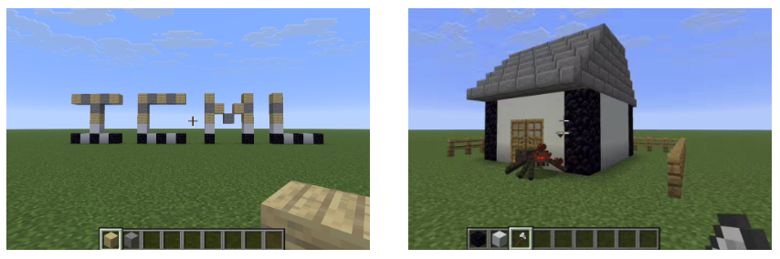

# LLM Collaboration – Minecraft

This repo provides the Minecraft environments for [**CoMLRL**](https://github.com/OpenMLRL/CoMLRL).



## Installation

Install [**CoMLRL**](https://github.com/OpenMLRL/CoMLRL):

```bash
pip install comlrl
# Install PyTorch compatible with your device
```

Or via conda-forge:

```bash
conda install -c conda-forge comlrl
# Install PyTorch compatible with your device
```

Install the Mineflayer dependencies:

```bash
cd LLM_Collab_Minecraft
npm install
```

## Environments

- **StrBuild**: agents build structures from string blueprints.
- **HouseBuild**: agents construct houses from layered blueprints under resource limits and spider attacks.
- **BridgeBuild**: two agents collaboratively build a bridge between two anchored banks under fog-of-war, probe, and communication costs.
- **ResourceGathering**: two agents with asymmetric tools (one harvests wood, the other harvests stone and iron) collect target amounts of wood, stone, and iron from a partially observable grid; an agent often observes resources its teammate must collect, so resource facts must be communicated.

## Training Scripts

StrBuild:

```bash
python3 str_build/train/train_magrpo.py --config str_build/configs/str_build_magrpo_config.yaml
python3 str_build/train/train_iac.py --config str_build/configs/str_build_iac_config.yaml
python3 str_build/train/train_maac.py --config str_build/configs/str_build_maac_config.yaml
```

HouseBuild:

```bash
python3 house_build/train/train_magrpo.py --config house_build/configs/house_build_magrpo_config.yaml
python3 house_build/train/train_iac.py --config house_build/configs/house_build_iac_config.yaml
python3 house_build/train/train_maac.py --config house_build/configs/house_build_maac_config.yaml
```

BridgeBuild:

```bash
python3 bridge_build/train/train_magrpo.py --config bridge_build/configs/bridge_build_magrpo_config.yaml
python3 bridge_build/train/train_iac.py --config bridge_build/configs/bridge_build_iac_config.yaml
python3 bridge_build/train/train_maac.py --config bridge_build/configs/bridge_build_maac_config.yaml
```

ResourceGathering:

```bash
python3 resource_gathering/train/train_maac.py --config resource_gathering/configs/comlrl/resource_gathering_maac_config.yaml
```

Override any configuration value inline with `--override`:

```bash
python3 str_build/train/train_magrpo.py \
  --config str_build/configs/str_build_magrpo_config.yaml \
  --override agent_model.name='Qwen/Qwen2.5-1.5B-Instruct' magrpo.num_turns=1
```

## Multi-Turn External Feedback

Enable multi-turn training by setting `magrpo.num_turns` / `iac.num_turns` / `maac.num_turns` > 1 and choose an `external.mode`.

StrBuild modes:

- `perfect_feedback`
- `position_feedback`
- `score_feedback`

HouseBuild modes:

- `perfect_feedback`
- `position_feedback`
- `position_modification`
- `rect_modification`
- `resource_schedule`
- `score_feedback`

BridgeBuild modes:

- `empty_feedback` (default)
- `perfect_feedback`
- `position_feedback`
- `score_feedback`

## BCMAAC (CoTI) Setup

BCMAAC (Belief-Conditioned Multi-Agent Actor-Critic) is trained on
**ResourceGathering** and **BridgeBuild**. Both tasks are two-agent Dec-POMDPs with
a 4-turn horizon and deterministic JSON action parsing.

### Datasets

| Task                 | File                                                                                    | Train / Eval | Horizon |
|----------------------|-----------------------------------------------------------------------------------------|--------------|---------|
| `resource_gathering` | [resource_gathering/dataset/data.json](resource_gathering/dataset/data.json)            | 7 / 7        | 4       |
| `bridge_build`       | [bridge_build/dataset/data.json](bridge_build/dataset/data.json), [bridge_build/dataset/data2.json](bridge_build/dataset/data2.json) | 6 / 3        | 4       |

- **Resource Gathering** contains 14 synthetic grid maps (sizes 8×8, 9×9, and 10×10)
  covering directional forest/mineral separations, diagonal exchange, longer maps, and
  mixed-hub layouts. Team goal: **3 wood, 3 stone, 1 iron** within 4 turns. View
  radius 2, suggested path length ≤ 4; an extraction succeeds only when the target
  cell is within Manhattan distance 2 of the final position.
- **Bridge Building** contains 9 synthetic 13×11 maps differing in starting-side
  configuration, pillar layout, support density, and hazardous-support placement.
  Each map has roughly 30 candidate pillars (true supports + hazardous fake supports).
  A response may probe up to 3 pillars and issue bridge-construction commands under
  a per-turn command budget.

### Action format

Both tasks require exactly one JSON object per turn:

```jsonc
{
  "comm":  { /* structured environment facts to broadcast */ },
  "probe": [[x, z], ...],          // bridge_build: candidate pillars to probe
  "cmds":  [...],                  // extraction targets (RG) or bridge cmds (BB)
  "path":  [[x, z], ...]           // movement path within max_path_len
}
```

### Training

`train_coti.py` runs both BCMAAC (`bcmaac_meta_*` configs) and the MAAC baseline
(`bcmaac_baseline_*` configs) under the same actor, rollouts, rewards, and
environment.

```bash
# Resource Gathering — BCMAAC
python -m LLM_Collab_Minecraft.resource_gathering.train.train_coti \
  --config LLM_Collab_Minecraft/resource_gathering/configs/coti/bcmaac_meta_data_full.yaml

# Resource Gathering — MAAC baseline
python -m LLM_Collab_Minecraft.resource_gathering.train.train_coti \
  --config LLM_Collab_Minecraft/resource_gathering/configs/coti/bcmaac_baseline_data_full.yaml

# Bridge Building — BCMAAC
python -m LLM_Collab_Minecraft.bridge_build.train.train_coti \
  --config LLM_Collab_Minecraft/bridge_build/configs/coti/bcmaac_meta_data_full.yaml

# Bridge Building — MAAC baseline
python -m LLM_Collab_Minecraft.bridge_build.train.train_coti \
  --config LLM_Collab_Minecraft/bridge_build/configs/coti/bcmaac_baseline_data_full.yaml
```

Reference hyperparameters: 180 epochs, rollout/batch 8/4, $\gamma=0.9$,
actor/critic LR $2.5\times10^{-6}$, context LR $3.0\times10^{-5}$, 160 max new
tokens, Qwen3-4B-Instruct-2507 in bf16. Override any field with
`--override key.path=value ...`.

### Evaluation

`collab_eval/run_eval.py` runs `parallel` (prompt-only, both agents act in parallel)
or `pipeline` (prompt-only, fixed agent order) prompt-only baselines on the same
instances and metrics used during training:

```bash
python -m LLM_Collab_Minecraft.resource_gathering.collab_eval.run_eval --mode parallel
python -m LLM_Collab_Minecraft.bridge_build.collab_eval.run_eval     --mode pipeline
```

Task-native metric is **episode success**: Resource Gathering succeeds when all
resource targets are met; Bridge Building succeeds when the final traversable set
connects the two anchor regions under four-neighbor connectivity.

### Rewards (summary)

- **Resource Gathering**:
  $r^{\mathrm{RG}}_t = 8.0\,\Delta p_t + 7.0\,c_t + 0.1\,u_t + 0.05\,z_t + 0.15\,e_t - 0.1\,w_t$,
  with $p_t$ collection progress, $c_t$ terminal-completion indicator, $u_t$ useful
  resource facts, $z_t$/$e_t$ zone-routing terms, $w_t$ wasted extractions.
- **Bridge Building**: $r^{\mathrm{BB}}_t$ combines connection-gap reduction
  $g_{t-1}-g_t$, newly merged components $m_t$, true-support connections $y_t$,
  terminal connectivity $c_t$, cross-side movement $\Delta d_t$, fake-support unsafe
  adjacencies $-n_t$, block usage $-b_t$, and a late-turn quality term
  $q^{\mathrm{late}}_t$.

### Method overview

BCMAAC builds a compact structured side-information tensor $x_{i,t}$ from each
agent's own observations, received communication, and parser output (no privileged
state), encodes it with a recurrent belief encoder, and uses the joint belief
context inside a centralized structured critic. Auxiliary losses provide task-belief
supervision (per-cell support targets) and partner-action supervision (action
preference over `comm` / `probe` / `cmds`).
